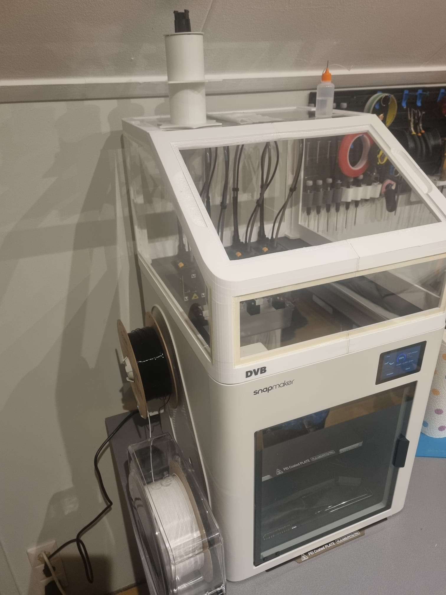
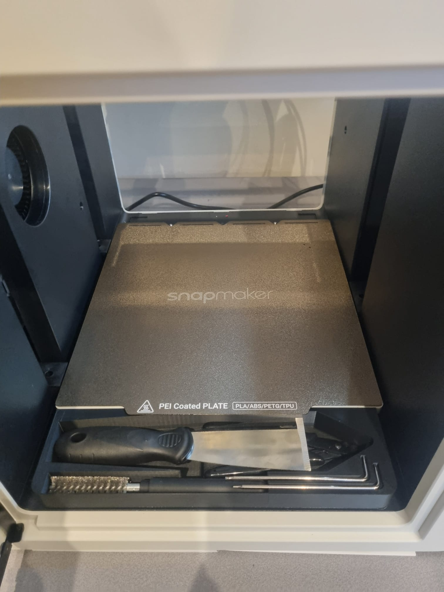

I have a snapmaker U1 to which I have made some upgrades already.
Current upgrades:
-Top hat by shrin
-Snapmaker U1 Toolbox
-Hula anti vibration feet
-Auxilary fan cover
Models can be found on makerworld.

**Images:**

---
[ BACK TO REPO ](/changelog/suzuki/)