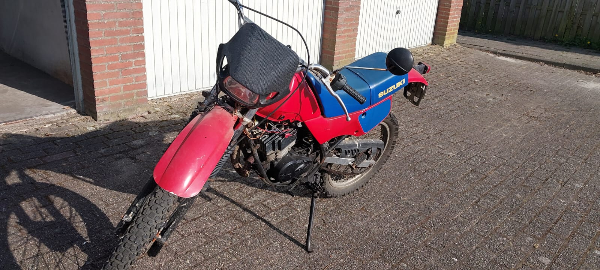
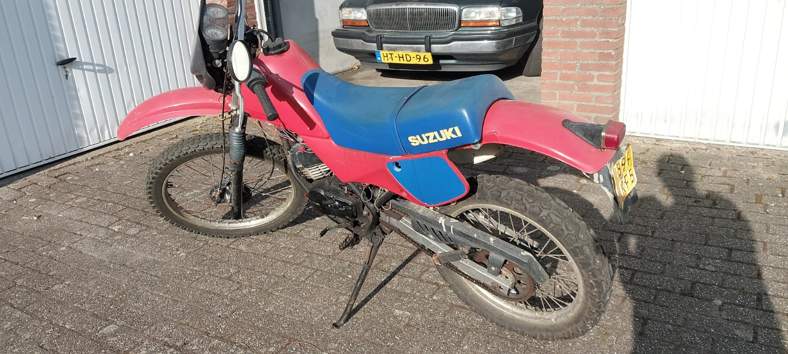
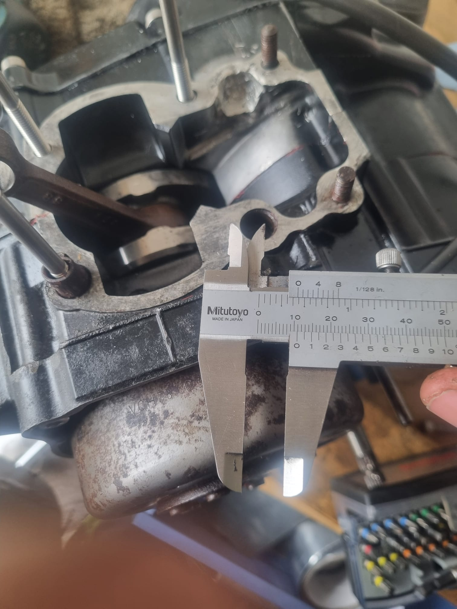
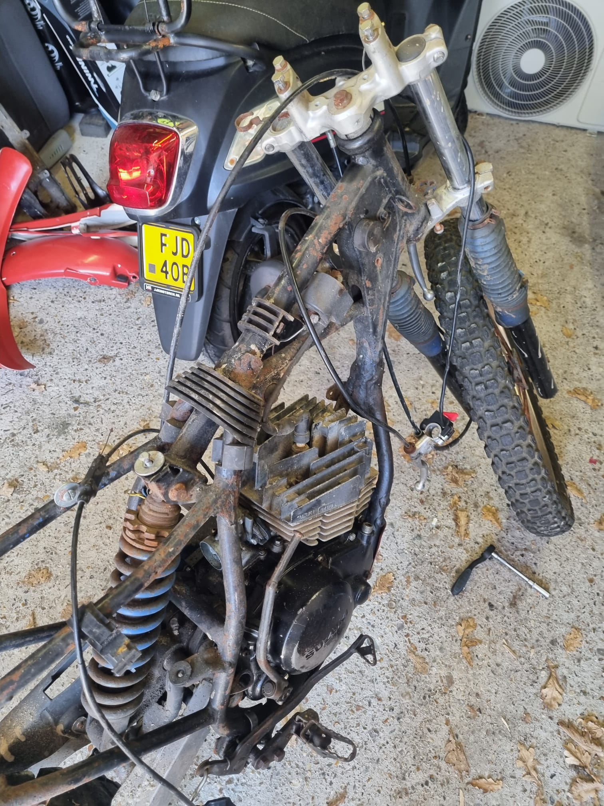
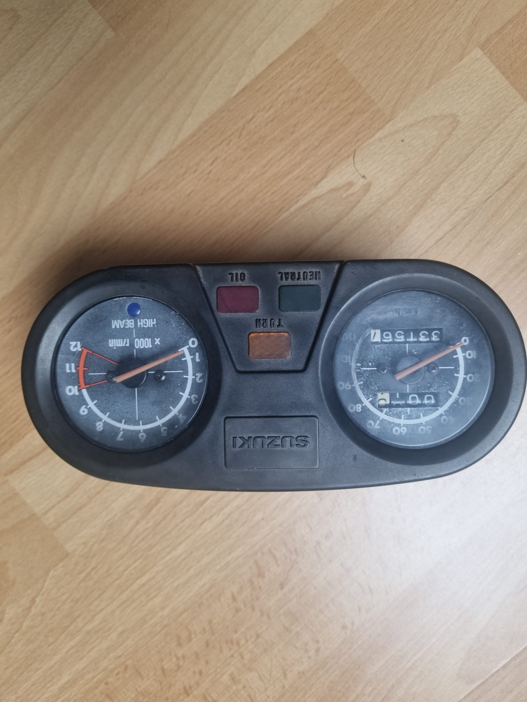
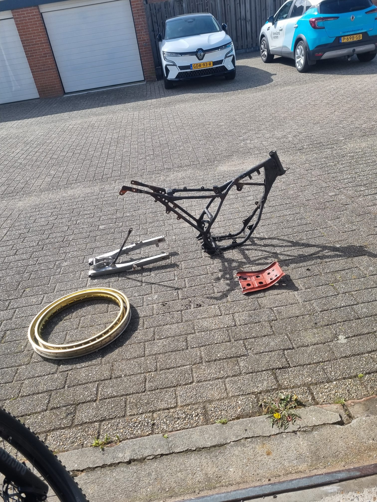
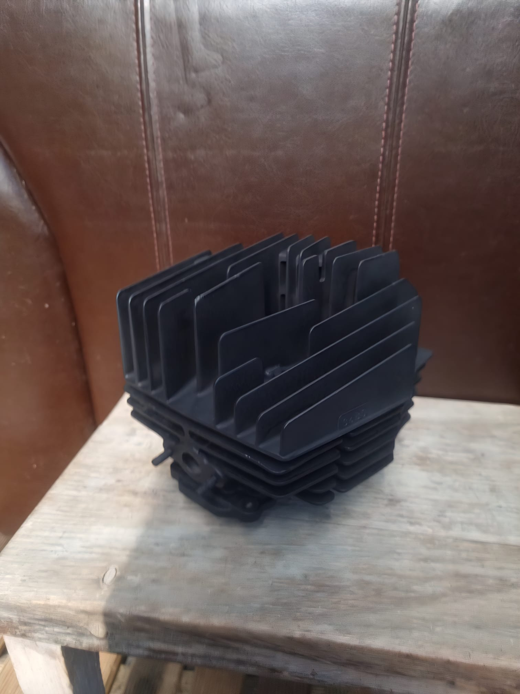

Last year I bought a suzuki TS50X, since then I have almost finished a full rebuild of the engine, and I've started on making all the parts ready for repainting/powder coating (depends on the price).

**Images:**

---
[ BACK TO REPO ](/changelog/suzuki/)